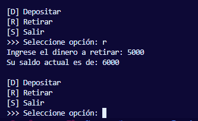

# 🏦 Desafío Cuenta Bancaria - POO Python

**Desafío Cuenta Bancaria** es una aplicación de consola diseñada para simular la gestión básica de un cliente bancario. Este proyecto es una implementación práctica de los pilares de la **Programación Orientada a Objetos (POO)**, centrada específicamente en la **Herencia** y el manejo de estado a través de clases.

El sistema permite crear un cliente, visualizar sus datos y realizar transacciones monetarias en tiempo real a través de un menú interactivo.


## 📸 Demo en Consola

 


## 📋 Características del Sistema

* **👤 Estructura de Clases (Herencia):**
    * Clase Padre `Persona`: Maneja los atributos básicos de identidad (Nombre, Apellido).
    * Clase Hija `Cliente`: Hereda de `Persona` y extiende su funcionalidad agregando atributos bancarios (Número de cuenta, Balance).
* **💰 Gestión de Transacciones:**
    * **Depositar:** Aumenta el balance con validación de montos positivos.
    * **Retirar:** Disminuye el balance con validación de fondos suficientes (evita saldos negativos).
* **🖥️ Interfaz de Comandos (CLI):**
    * Menú iterativo (`while loop`) que mantiene el programa en ejecución.
    * Control de flujo moderno utilizando `match / case`.
* **🔒 Encapsulamiento de Lógica:**
    * Los métodos de negocio (`depositar`, `retirar`) pertenecen al objeto, no al flujo principal.

## 🛠️ Tecnologías y Conceptos

* **Python 3.10+**: Requisito obligatorio debido al uso de la sentencia `match/case`.
* **POO (OOP):** Clases, Objetos, Atributos, Métodos y Herencia (`super().__init__`).
* **Métodos Especiales:** Implementación de `__str__` para una representación en cadena legible del objeto.

## ⚙️ Instalación y Ejecución

1.  **Clonar el repositorio:**
    ```bash
    git clone [https://github.com/tu-usuario/desafio_cuenta_bancaria.git](https://github.com/tu-usuario/desafio_cuenta_bancaria.git)
    ```

2.  **Verificar versión de Python:**
    Asegúrate de tener la versión 3.10 o superior:
    ```bash
    python --version
    ```

3.  **Ejecutar el programa:**
    ```bash
    python main.py
    ```

## 🚀 Uso

Al iniciar el programa, el sistema te pedirá tus datos para crear tu perfil de cliente. Luego, podrás seleccionar las operaciones:

1.  **[D] Depositar:** Ingresa el monto a sumar a tu cuenta.
2.  **[R] Retirar:** Intenta extraer dinero (el sistema validará si tienes saldo suficiente).
3.  **[S] Salir:** Termina la sesión y cierra el programa.

## 🧠 Estructura del Código

```mermaid
classDiagram
    class Persona {
        +nombre
        +apellido
    }
    class Cliente {
        +numero_cuenta
        +balance
        +depositar()
        +retirar()
        +__str__()
    }
    Persona <|-- Cliente : Hereda de
